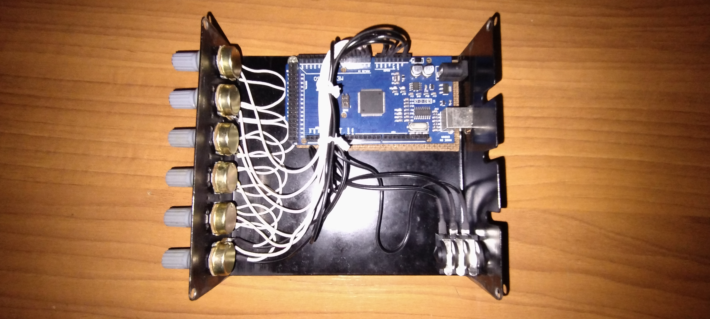

# Controlador MIDI com Arduino
Este repositório contém um projeto de controlador MIDI baseado em Arduino, que permite controlar dispositivos MIDI, como sintetizadores e software de música, através de sensores e botões personalizados.



### Código 
```cpp
int valPot1 = 0;
int lastValPot1 = 0;

int valPot2 = 1;
int lastValPot2 = 1;

int valPot3 = 2;
int lastValPot3 = 2;

int valPot4 = 3;
int lastValPot4 = 3;

int valPot5 = 4;
int lastValPot5 = 4;

int valPot6 = 5;
int lastValPot6 = 5;

int valPot7 = 6;
int lastValPot7 = 6;
//Pedal

void setup() {
  Serial.begin(9600);
}

void loop() {
  valPot1 = analogRead(0)/8;
  valPot2 = analogRead(1)/8;
  valPot3 = analogRead(2)/8;
  valPot4 = analogRead(3)/8;
  valPot5 = analogRead(4)/8;
  valPot6 = analogRead(5)/8;
 
  
  int valorPotenciometro = analogRead(A7);
  int valPot7 = map(valorPotenciometro, 109, 450, 0, 127);
  
  if(valPot1 != lastValPot1){
    mensagemMIDI( 176,2,valPot1);
    lastValPot1 = valPot1; 
    //Serial.println(lastValPot1);
  }
  if(valPot2 != lastValPot2){
    mensagemMIDI( 176,3,valPot2);
    lastValPot2 = valPot2;
    //Serial.println(lastValPot2); 
  }
  if(valPot3 != lastValPot3){
    mensagemMIDI( 176,4,valPot3);
    lastValPot3 = valPot3; 
    //Serial.println(lastValPot3);
  }
  if(valPot4 != lastValPot4){
    mensagemMIDI( 176,5,valPot4);
    lastValPot4 = valPot4; 
    //Serial.println(lastValPot4);
  }
    if(valPot5 != lastValPot5){
    mensagemMIDI( 176,6,valPot5);
    lastValPot5 = valPot5; 
    //Serial.println(lastValPot5);
  }
  if(valPot6 != lastValPot6){
    mensagemMIDI( 176,7,valPot6);
    lastValPot6 = valPot6; 
    //Serial.println(lastValPot6);
  }

  if(valPot7 != lastValPot7){ 
    if (valPot7 >= 10 && valPot7 <= 120) {
      mensagemMIDI( 176,8,valPot7);
      lastValPot7 = valPot7; 
      //Serial.println(lastValPot7);
    }
  }


  delay(10);
}

void mensagemMIDI(byte comando,byte data1, byte data2){
  Serial.write(comando);
  Serial.write(data1);
  Serial.write(data2);
}

``` 
